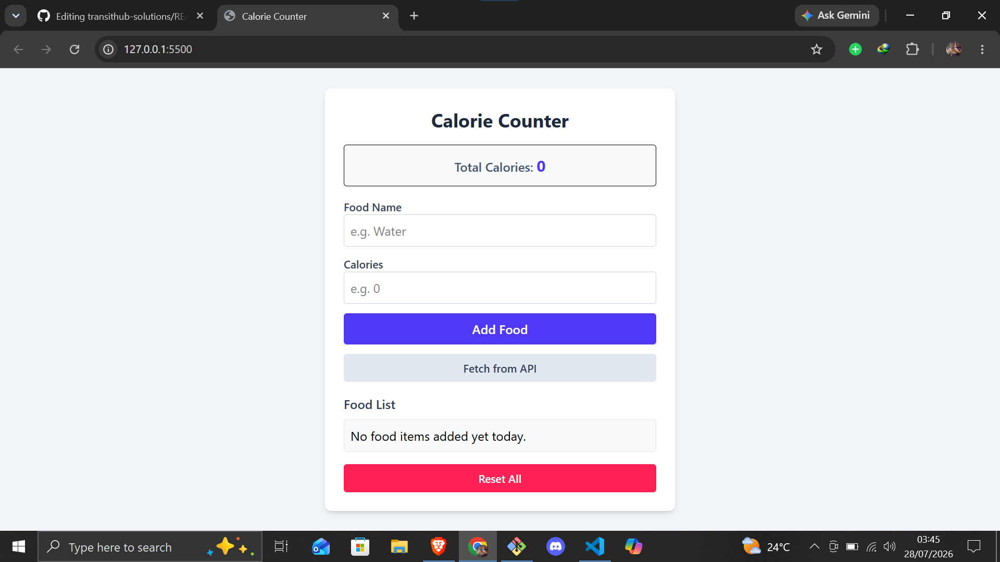

# Calorie Counter Application

## Project Overview
A responsive front-end web application built with HTML5, Tailwind CSS, and JavaScript that allows users to track their daily food consumption, monitor total calorie intake, and fetch live product data from an external API.

## Features
* **Add Food Items:** Input custom food names and calorie values to update the daily total.
* **Persistent Storage:** Utilizes browser `localStorage` to save and restore food items across browser sessions.
* **Dynamic UI Rendering:** Automatically updates the list view and total calorie tally upon additions, item deletions, or data resets.
* **API Barcode Fetching:** Includes a "Fetch from API" feature that selects a random sample barcode and retrieves real product details and calorie information from the Open Food Facts API using standard `fetch()` and `.then()` promise syntax.
* **Data Management:** Delete individual items from the log or reset all tracking data with a single click.

## Technologies Used
* **HTML5:** Structure, form elements, and semantic markup.
* **Tailwind CSS:** Responsive styling and layout utilities.
* **JavaScript:** DOM manipulation, event handling, state management, and asynchronous API requests.
* **LocalStorage API:** Client-side data persistence.
* **Open Food Facts API:** External food product database.

## Setup and Instructions
1. Clone the repository using the following link:(git@github.com:lameckkipsang/calorie-counter.git) or download the project files (`index.html` and `script.js`) into the same working directory.
2. Open the `index.html` file in any modern web browser or run it via a local development server (such as Live Server in VS Code).
## Website Preview 
### Homepage 

## Website Access
To open the website click on this link live url [Open Website](https://lameckkipsang.github.io/calorie-counter/)